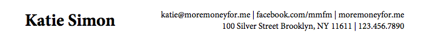
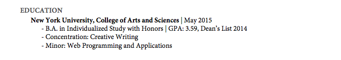
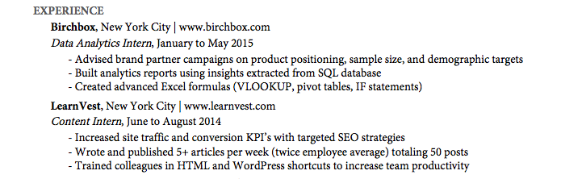
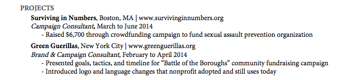
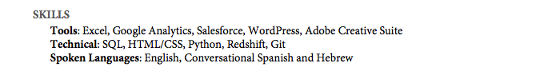

Charla: ¿Cómo Conseguir un Trabajo en las 4+1 grandes?
=============================

  
Esta charla está enfocada brindar las herramientas necesarias para que un estudiante común sepa que hacer para ser notado en un proceso de contratación con altos estándares. Se enfocará en los procesos de contratación para pasantías de Google, Amazon, Apple, Facebook y Microsoft. Cabe destacar que, aunque cada empresa tiene sus particularidades, el proceso es muy similar al de otras empresas, lo que diferencia a las grandes compañías del resto son sus altos estándares.

## Primeros Pasos
En el archivo [Charla_HTGJB5.pdf](Charla_HTGJB5.pdf) puede encontrar la presentación que usaron los expositores para la charla. En este readme puede encontrar la mayoría del material consultado para esta charla. El material se seguirá actualizando luego de la misma.

## Expositores

* **Malcolm Davis** - @[malkam03](https://github.com/malkam03)  
* **Joseph Salazar** - @[saj11](https://github.com/saj11)

## Motivación
El realizar una pasantía en una gran empresa es algo que alimenta las habilidades de las personas, les cambia la persepctiva de lo que es la empresa tecnológica y abre las puertas a muchas más oportunidades. Cada empresa tiene sus atractivos y dependiendo de los intereses y habilidades de cada persona se puede sobresalir en alguna o otra y dar una buena impresión. Y la única forma de lograr esto es quitarse el miedo a fallar y aplicar.

#### Material Adicional:
* https://www.youtube.com/watch?v=9No-FiEInLA
* https://www.youtube.com/watch?v=CPVWzx71LpQ
* https://www.youtube.com/watch?v=O4GlhkRHjQE
* https://youtu.be/6o2mfAPumQg?t=75
* https://www.youtube.com/watch?v=lz7orGnRJ4k&t=29s

## ¿Cómo Sobresalir?
Lo primero que hay que tener en cuenta al aplicar a una empresa, es que probablemente muchas más personas hayan aplicado para el mismo puesto, y no todos pueden ser elegidos. Por esta razón para no ser sólo otro pdf que llega al correo del reclutador, se debe de tener un background diferente al resto de personas.  
Para lograr esto se recomienda participar en actividades extracurriculares que puedan enriquecer su experiencia. Algunas de estas actividades incluyen:
* Asistencias de Cursos
* Asistencias de Proyectos de Investigación
* Tutorías de Cursos o Independientes
* Competencias Internacionales Reconocidas
* Proyectos Personales
* Proyectos de Software Libre
* Voluntariados
* Pasantías
* Deportes o Música  

#### Material Adicional:
* https://www.youtube.com/watch?v=E2dMmdewRxE
* https://www.youtube.com/watch?v=k-baHBzWe4k&t=5s
* https://www.youtube.com/watch?v=klXNkEdR1cY

## Preparación del Currículo
Listo, ya tengo experiencia y un background que me puede hacer sobresalir. **¿Ahora qué?**.  
Al ser tantas las personas que aplican a un puesto, los reclutadores pueden dedicar poco tiempo a cada una. Y en aproximadamente 6 segundos repasan cada currículo buscando esas cosas que lo hacen sobresalir de los demás candidatos y que encajan con el perfil para el puesto que se busca. Por esa razón el currículo debe de ser conciso, preferiblemente 1 o 2 páginas de información. Ahora bien, ¿qué debería de contener?. Un currículo debería de contener:
* **Información de contacto:** Si no existe ninguna forma para contactarlo de vuelta, entonces no gana nada llamando el interés del reclutador. Se debe de incluir nombre, correo electrónico, número telefónico, dirección y dependiendo del país a aplicar se puede o no incluir una foto. 
* **Información relevante a la Educación:** Acá se agregan los títulos obtenidos en la universidad, cursos online, talleres… Siempre y cuando sean relevantes para el puesto a aplicar. Se debe agregar la fecha y se pueden agregar logros o reconocimientos obtenidos. 
* **Experiencia:** Se debe de acomodar en orden cronológico. Al reclutador le interesa lo que usted hace ahora no que hizo hace 20 años(¿probablemente ser un óvulo fecundado?). Se pone el lugar, la fecha y se puntualiza con viñetas lo que se logró. Para redactar los logros que usted realizó en esta experiencia se aconseja usar [verbos poderosos](https://www.themuse.com/advice/185-powerful-verbs-that-will-make-your-resume-awesome). Y cuantizar su aporte(utilizar datos y métricas de éxito).
* **Proyectos, Actividades y Liderazgo:** Si recuerda el background que se construyó anteriormente, este es el momento para elegir de lo que ha hecho lo más importante para el puesto y resaltarlo(*cough* presumirlo *cough*). Los proyectos de cursos, extracurriculares, competencias… que puedan capturar el interés del reclutador se agregan con los mismos consejos que se usó para experiencia, nombre, lugar, fecha, verbos de poder, viñetas, impacto generado. 
* **Habilidades:** La última sección que debe de contener el currículum es un resumen de las habilidades más relevantes. Con viñetas y si existe algún tipo de agrupación se puede hacer.   
En general se quiere mostrar lo más importante/atractivo para el puesto que se quiere aplicar y la empresa, por eso hay que hacer un research de la misma y ver qué cosas de la cultura organizacional y habilidades requeridas para el puesto se alinean con su propio background y principios para poder resaltar estas.  

#### Material Adicional:
* http://computerhoy.com/noticias/life/modelo-curriculum-que-arrasa-empresas-incluso-google-60652?utm_content=buffer26a8f&utm_medium=Social&utm_source=Facebook&utm_campaign=CH
* https://www.quora.com/topic/Resumes-and-CVs
* https://www.quora.com/What-do-recruiters-look-for-in-a-resumé-at-first-glance
* https://www.quora.com/How-can-a-software-engineer-write-a-killer-resume
* https://www.quora.com/What-does-Google-look-for-in-a-resume-for-Software-Engineering-Internship-role
* https://www.youtube.com/watch?v=RA0rWSrb318&t=47s
* https://www.youtube.com/watch?v=ZjeXxLnnH5I
* https://youtu.be/HcNr23p-92U
* https://www.youtube.com/watch?v=5wa9J7iXOh0

## Preparación para la Entrevista
Para los procesos de contratación o selección para pasantías se hacen varias entrevistas (de 3 a 5 dependiendo de la compañía ya la situación). Algunas entrevistas son técnicas con algún ingeniero del equipo encargado de una tecnológia para evaluar su conocimiento de la misma. Y otras son para evaluar sus habilidades blandas.  
Lo primero que se debe de hacer para la preparación para la entrevista es reafirmar por qué quiere trabajar en esa compañía, cuales son sus intereses. Luego estudiar el currículum que envió y preguntarse: de los proyectos que ha realizado ¿Cúal ha sido el más difícil?, ¿Cúal ha sido el bug más extraño que see encontrado?, ¿Cúal es el problema mayor que se he encontrado?. ¿Cómo ha solucionado esos problemas?, ¿Qué ha aprendido?, etc... Estas preguntas le enseñan al entrevistador cúal es su forma de responder ante alguna situación.
Además, preparar preguntas que hacer al entrevistador, acerca del proyecto, tecnológias que usan y otras cosas que demuestren el interes que usted tiene.   
Para las entrevistas técnicas, lo mejor es prácticarlo antes con otras personas. Normalmente, y a menos que aplique para un puesto específico, los temas que debería de dominar mínimo son: Listas, Arboles, Colas, Pilas, Vectores y Arreglos, Hash Tables, Algoritmos de Busqueda y recorrido en las estructuras anteriores, Busqueda Binaria, Merge Sort, Quick Sort, Operaciones sobre arboles, Manipulación de bits, Singletons, Factory, Pila y Heap, Recursividad y Análisis de complejidad de algoritmos.  
El objetivo de las entrevistas técnicas es resolver problemas que el entrevistador presenta en una pizarra(o un documento en docs). Por esta razón se recomienda prácticar programar en papel, y solucionar problemas entendiendo la solución y no memorizando la respuesta. Lo ideal es analizar el problema e ir explicandole al entrevistador que es lo que entiende y como lo piensa realizar. Primero con la solución más fácil y luego ir optimizando. Siempre comunicar lo que se piensa, aunque no sepa bien como resolver el problema en un principio, el entrevistador lo guiará en este caso. Y muy importante hacer las preguntas adecuadas para poder resolver el problema. 
#### Material Adicional:
* Libro [Cracking the Coding Interview](https://g.co/kgs/4Wvkwa).
* Libro [Programming Interviews Exposed](https://g.co/kgs/XuuskS).
* https://fearlesssalarynegotiation.com/the-dreaded-salary-question/?utm_medium=social&utm_source=quora.com
* https://www.educative.io/collection/5668639101419520/5649050225344512
* https://www.quora.com/What-are-some-most-tricky-questions-asked-in-interview
* https://www.youtube.com/channel/UCIDZwtgsWOzJinPzyeIodRQ
* https://www.quora.com/What-are-some-green-flags-in-a-job-interview
* https://www.fasterskills.com/blog/how-to-answer-job-interview-question-tell-me-about-yourself
* https://www.bayt.com/en/blog/3664/10-steps-to-a-good-job-interview/
* https://www.quora.com/What-are-the-worst-mistakes-people-make-in-job-interviews
* https://www.mtu.edu/career/students/toolbox/interviews/prepare.pdf
* https://www.youtube.com/watch?v=gb3Wed9M25A
* https://www.youtube.com/watch?v=ko-KkSmp-Lk
* https://www.youtube.com/watch?v=XKu_SEDAykw
* https://www.youtube.com/watch?v=dEeoT377NJE
* https://www.youtube.com/watch?v=55aEVvITNJ0
* https://www.youtube.com/watch?v=eaYX0Ee0Kcg
* https://www.youtube.com/watch?v=bGC2fNALbNU
* https://www.youtube.com/watch?v=uQdy914JRKQ
* https://www.youtube.com/watch?v=lbLZiHvPIKE

## En la Entrevista
Si llegó a este punto, sólo relajese, demuestre lo que sabe y diviertase. El entrevistador es sólo otra persona que quiere conocerlo, y está esperando que usted sea esa persona que buscan(así no tiene que seguir teniendo reuniones incómodas y puede seguir con su trabajo).  
Algunas diferencias entre las entrevistas de las empresas son:
* Google: Los entrevistadores hacen un reporte que llega a un comité de contrataciones, dependiendo de ese reporte se toma la decisión.
* Amazon: Existe entre los entrevistadores uno que no es parte del grupo que levanta los estándares(lo pone más difícil).
* Apple: Normalmente hacen una entrevista con más de un entrevistador a la vez.
* Microsoft: Luego de pasar varias entrevistas, el encargado de hacer la contratación se reune con usted, si llega ahí es una buena señal.  
##### Por último. ¡Le deseo muchos exitos en esta aventura!    
 

## Extras
* Página para encontrar competencias [MLH](https://mlh.io/seasons/na-2017/events)
* Página para encontrar proyectos de software libre [Up-For-Grabs](http://up-for-grabs.net/#/)
* Página para encontrar voluntareados [ONG Voluntariado](http://www.ongvoluntariado.org/voluntariado-costa-rica/)
#### ¿Donde aplicar?
* [Google](https://www.google.com/careers/students)
* [Facebook](https://www.facebook.com/careers/university/)
* [Microsoft](https://careers.microsoft.com/students/internships)
* [Amazon](https://www.amazon.jobs/team/university-internships)
* [Apple](https://www.apple.com/jobs/us/students.html)

## Licencia
Este proyecto está licenciado bajo la licencia del MIT,  - ver [LICENSE.md](LICENSE.md) para más detalles.

## Reconocimientos 
* Libro [Cracking the Coding Interview](https://g.co/kgs/4Wvkwa).
* Libro [Programming Interviews Exposed](https://g.co/kgs/XuuskS).
* La ayuda de las Ing. de Google.  
* Los videos con material de los youtubers publicados acá.
* Los blogs informativos con material publicados acá. 

## Descargo
Este repositorio es de mi propiedad [malkam03](https://github.com/malkam03), y aunque sea para una charla para el capítulo Computer de IEEE, no es un sitio de información oficial de este ente, ni tampoco expresa las opiniones del mismo.

